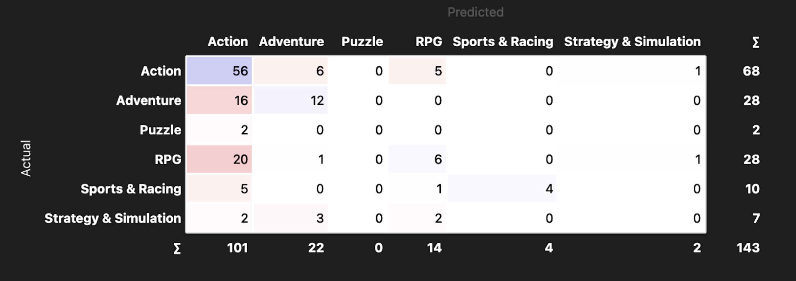
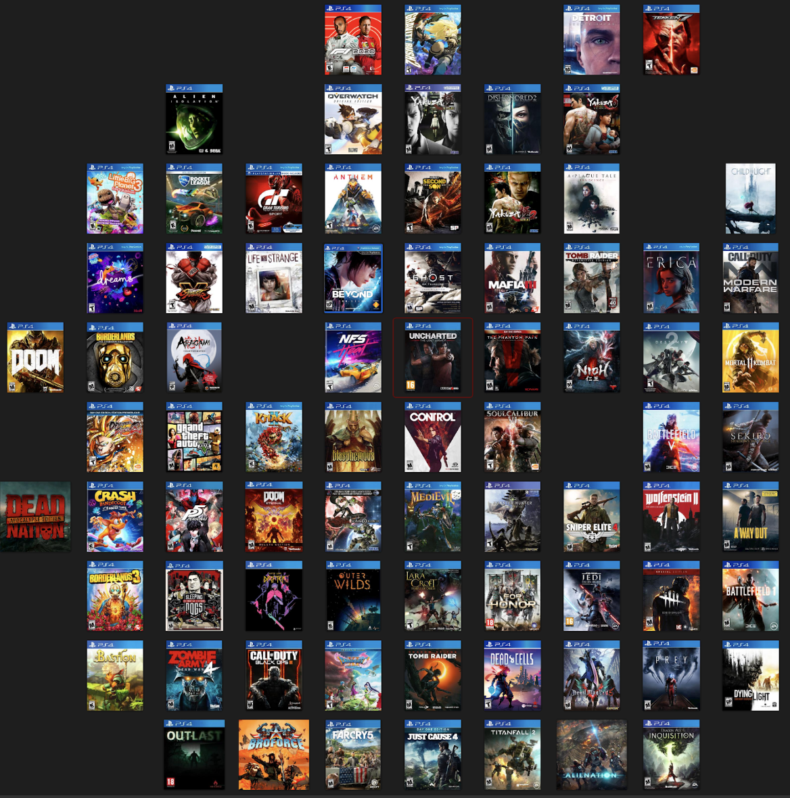
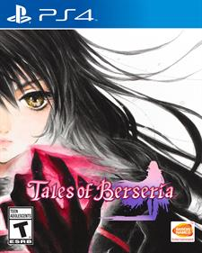
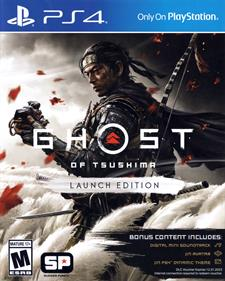

## Introduction and Idea Creation

Tasked yet again to build another corpus, we thought heavily about what to explore in our final assignment. After all, there are millions of different images that one can find on the World Wide Web. After long thought and consideration of various cultural domains, we managed to narrow down our brainstorming. We, and millions of people, are fond of video games. Fortunately for us, there have been thousands of video games made, and similar to other forms of entertainment or media, visual art is an integral part of this medium. However, video game cover art in general is too broad a topic, so our first step was to narrow down the focus. This led us to think about console video game covers, namely, the game cover art for Sony's PlayStation 4 video games. We chose this console due to its popularity, selling over 117 million units by 2024, higher than nearly all other consoles except the PlayStation 2 and Nintendo Switch, according to [Florian Zandt](https://www.statista.com/chart/18903/video-game-console-sales/). Due to the console's popularity, game cover art for its CDs became an iconic part of the gaming community and arguably international pop culture. Unlike modern online gaming platforms/providers, these consoles relied heavily on the physical purchasing of the video games (CDs), and the game cover art of these CD boxes was an essential aspect of the game's marketing and success.

[Distant Viewing: Computational Exploration of Digital Images](https://direct.mit.edu/books/oa-monograph/5674/Distant-ViewingComputational-Exploration-of) by Taylor Arnold and Lauren Tilton delves into the very processes and explorations that we are attempting to do. Namely, [Chapter 3: Advertising in Color: Movie Posters and Genre](https://doi.org/10.7551/mitpress/14046.003.0006) sought out to explore how color in movie posters correlates with the genre of a film. Taking inspiration from their work, we decided to explore if similar trends could be uncovered with video game cover art. Does color necessarily represent the genre of the video game, or is there something more to it? Perhaps shapes or layout could be another important factor in generalizing the video game genre? Through the processes of web-scraping, data-processing, and extraction, we will build a corpus of over 150 images of the most popular PS4 video games (their cover art). With the help of tools as Orange Data Mining, 2DCLIP, and DV Explorer, we will engage in computational exercises, such as clustering, categorization, and multimodal processing, to explore and attempt to uncover underlying trends or patterns within console video game cover art, with a focus on the most popular video games for the PlayStation 4. 

## Building the Corpus / Data Set

We began by trying to download images from Google Images, but quickly realized that due to the variance in their quality, context, and overall how the image was taken, our dataset would end up very messy. To our luck, we managed to find a website, [LaunchBox Game Database](https://gamesdb.launchbox-app.com/platforms/games/50-sony-playstation-4/), which ended up being just what we needed. This website most likely contains nearly every game released to the console, along with the game's cover art. We could use a Google Chrome extension to download all the images from each page, but unfortunately, that would leave us with approximately 2300 images in total. Instead, we wanted to focus only on the top 200 most popular games that have been released. We created a list of the 200 most popular games released to the console using ChatGPT. With its ability to search and read articles and other webpages online, we tasked it to build a text file containing these games based on the games' market performance (sales, reviews, etc.). Finally, we wrote a simple [Python script](assets/files/download_ps4_images.py), using the HTTP and Requests module to scrape the website, page by page, and download only the images for the top 200 games. Luckily for us, the website's "game cards" were static HTML elements, and we were able to successfully extract a total of 143 of the 200 game cover images that were on our list. Our dataset was now ready.

## Clustering (Orange Data Mining) 

Our first analysis is based on the Orange Data Mining workspace created by our instructor which takes an image corpus and clusters them. It works by using Google's InceptionV3, a deep neural network for image recognition. It uses image embedding which is a process that converts images into numerical representations (vectors) capturing their visual and semantic features. After uploading the corpus into the workspace, an image grid was created. It appears that each cover is positioned according to its visual similarity to others, as determined by the neural network's feature extraction. 

There is a clear tendency for games with similar dominant colors or art styles to cluster together. For example, covers with bright, cartoonish palettes (like "Crash Bandicoot" and "Rayman Legends") are grouped in the lower left, while darker, more realistic or horror-themed covers ("Resident Evil," "Outlast," "Alien Isolation") are positioned in the upper and right regions. Sports games such as "NBA 2K21," "FIFA 21," and "F1 2020" are close together, reflecting their similar cover layouts and color schemes. Racing games ("Need for Speed Heat," "Gran Turismo Sport," "The Crew 2") form another tight cluster, as do open-world action games and RPGs in the central and lower portions. Multiple games from the same franchise (e.g., "Yakuza 0," "Yakuza Kiwami," "Yakuza Kiwami 2," "Yakuza 6") are placed close to each other, indicating the model's sensitivity to consistent branding and recurring visual motifs across sequels. The clustering exposes how certain genres adhere to specific visual conventions, making them instantly recognizable. Sports games, for instance, consistently use athlete imagery and clean backgrounds, while RPGs and action games often feature elaborate scenes or character groupings.

## Categorization (Orange Data Mining)

For the next step of our analysis, we decided to explore how well a prediction algorithm could classify the dataset. Since every game belongs to a particular genre (action, shooter, puzzle, etc.), we decided to test whether an algorithm would be able to classify and distinguish the various cover arts into their respective game genres. Since splitting nearly 150 different images into their folders would take a lot of time, we asked an LLM, ChatGPT 4o, to use a provided csv file, which included only the names of the games, and create two columns of data. The first column would be a categorization of the game, but limited to 6 different genres, the second, to seven. We also wrote a short Python script to go through the folder with all images and copy them into sub-folders with the respective category names. We first used the Inception v3 algorithm for the image embedding, and we got the following confusion matrix, along with the image grid of the correctly classified images.

As shown in the confusion matrix, the algorithm did very well in predicting action games, better than any other category. Observing the image grid on the right shows us all the accurately predicted images. One similarity that all the accurately predicted images have is that there is a lot of noise within them. Each cover art is vibrant, has many difficult colors, shapes overlapping, bold and big text, and all these other characteristics, which could suggest why the algorithm classified them together. One thing to note is that despite the different categories we created, it seems that the algorithm classifies the vast majority of games as "Action." 

## Multimodal Analysis (2DCLIP) 

Our next tool is 2DCLIP, which uses OpenAI's CLIP to transform complex, high-dimensional relationships among images into an interactive, visual map. This allows us to see, at a glance, how the collection is structured–revealing clusters and connections. The default clustering resulted in a similar grid to Orange Data Mining, revealing similarities between the posters such as color schemes and composition. However, with 2DCLIP, we could prompt the x and y axis which leverages the model's ability to organize or search the image and relate them to text descriptions. With this corpus, we plotted "auditory intensity" vs "japanese". With "auditory intensity" we wanted to see whether CLIP is able to link visual chaos to imagined sound. The upper region of the plot (high "auditory intensity") is populated by games like Control, Resident Evil 2, Resident Evil 3, The Evil Within 2, and Zombie Army 4 Dead War. These are mainly horror, action, or thriller games known for intense, immersive sound design-reflecting how the neural network associates certain visual cues (dark palettes, dramatic compositions, horror iconography) with the concept of "auditory intensity." With the "Japanese" axis, we wanted to test CLIP's awareness of geographically coded symbols in grouping region-specific games accurately. CLIP grouped the Yakuza games, Tales of Zestiria and Tales of Berseria, as more "Japanese" than others.

The Yakuza games have Japanese writing in their covers which explains why they are easily recognized as "Japanese". Tales of Zestiria and Tales of Berseria, despite not having any Japanese characters, is recognized as "Japanese" likely due to the anime-like art. 

However, there are games like Ghost of Tsushima (which is about a vengeful samurai) and Dark Souls (made by a Japanese game studio) that are not recognized as "Japanese". 

This cluster allows us to understand the extent of CLIP's training and its ability to recognize labels. As [Impett & Offert](https://www.tandfonline.com/doi/full/10.1080/01973762.2024.2362466) argue, "in reading a corpus of visual culture through a neural network, we are always also doing the reverse." By projecting game covers onto axes like "auditory intensity" and "Japanese," we see how these cultural and sensory concepts are distributed in the dataset. We learn, for example, that horror and action games, regardless of origin, are visually marked in ways that CLIP associates with "auditory intensity." The network's clustering shows that it recognizes "auditory intensity" as a visual property (darkness, drama, chaos), and that its understanding of "Japanese" is not strictly tied to developer nationality but to visual signifiers (art style, character design, typography). The overlap and separation in clusters reveal the model's latent biases and the features it prioritizes when mapping abstract prompts to visual data.

## Reflection and Conclusion 
This project demonstrates how computational tools like InceptionV3 and 2DCLIP can both illuminate and complicate our understanding of visual culture in video game cover art. By clustering and mapping PlayStation 4 covers, we uncovered clear genre conventions and branding strategies-sports games with athlete portraits, horror titles with dark and chaotic imagery, and Japanese RPGs with anime-inspired art-showing how visual language is used to signal content and appeal to audiences. We observed how the model can surface latent patterns and biases, but it also reinterprets cultural categories through the lens of its own training data. As [Impett & Offert](https://www.tandfonline.com/doi/full/10.1080/01973762.2024.2362466) suggest, the act of reading a visual corpus through a neural network is always reciprocal; we also read the network itself of its priorities, blind spots, and encoded assumptions. Our findings underscore the importance of critical engagement with AI tools in cultural analysis: they can reveal new connections and trends, but must be interpreted with an awareness of their constructed, partial view of visual meaning.
### Sources

[Figure 1. PS4 Game Collection.](https://www.wchbuy.shop/?path=page/ggitem&ggpid=1300396)

[Impet and Offert](https://www.tandfonline.com/doi/full/10.1080/01973762.2024.2362466)

[Orange Data Mining](https://orangedatamining.com/)

[2DCLIP](https://leoimpett.github.io/2dclip/)

